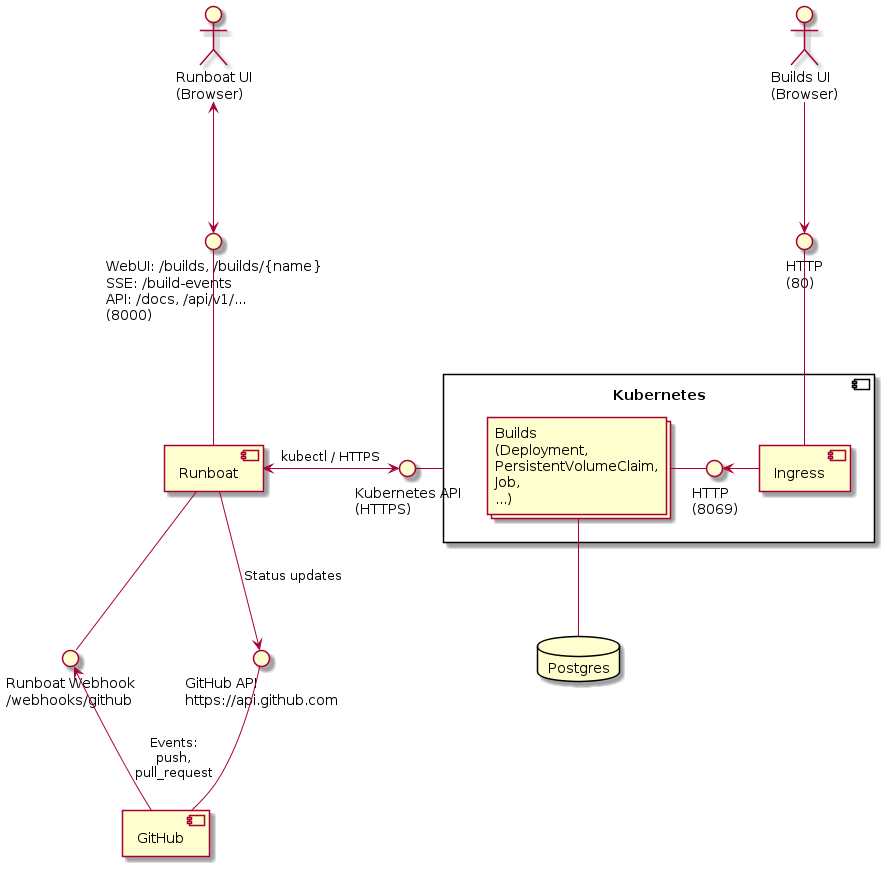

# runboat ☸️

A simple Odoo runbot lookalike on kubernetes. Main goal is replacing the OCA runbot.

[](https://results.pre-commit.ci/latest/github/sbidoul/runboat/main)

## Principle of operation

This program is a Kubernetes operator that manages Odoo instances with pre-installed
addons. The addons come from commits on branches and pull requests in GitHub
repositories. A deployment of a given commit of a given branch or pull request of a
given repository is known as a build.

Runboat has the following main components:

- An in-memory database of deployed builds, with their current status.
- A REST API to list builds and trigger new deployments as well as start, stop, redeploy
  or undeploy builds.
- A GitHub webhook to automatically trigger new builds on pushes to branches and pull
  requests of supported repositories and branches (configured via regular expressions).
- A controller that performs the following tasks:

  - monitor deployments in a kubernetes namespaces to maintain the in-memory database;
  - on new deployments, trigger an initialization job to check out the GitHub repo,
    install dependencies, create the corresponding postgres database and install the
    addons in it;
  - initialization jobs are started concurrently up to a configured limit;
  - when the initialization job succeeds, preserve the database, filestore, and virtual
    environment, so everything is ready for an almost instantaneous startup;
  - when the initialization job fails, flag the deployment as failed;
  - when there are too many deployments started, stop the oldest started;
  - when there are too many deployments, delete the oldest created;
  - when a deployment is deleted, run a cleanup job to drop the database and delete
    all kubernetes resources associated with the deployment.

This approach allows the deployment of a very large number of builds which consume no
memory nor CPU until they are started. The number of started deployment can also be
high, by reserving limited CPU and memory resources for each, taking advantage of the
fact that they are typically used infrequently. The number of concurrent initialization
jobs is limited strongly, and they are queued, as these are typically the more
resource-intensive part of the lifecycle of builds.

All state is stored in kubernetes resources (labels and annotations on deployments). The
controller can be stopped and restarted without losing state.

In practice the runboat controller does not know that it is deploying Odoo. All the
knowledge about *what* is deployed is in the
[src/runboat/kubefiles](./src/runboat/kubefiles) directory. The kubefiles must implement
a specific contract to be managed by the runboat controller. This contract is described
in the [Kubernetes resources](#kubernetes-resources) section below.

## Requirements

For running the builds:

- A namespace in a kubernetes cluster.
- A wildcard DNS domain that points to the kubernetes ingress.
- A postgres database, accessible from within the cluster namespace with a user with
  permissions to create databases.

For running the controller (runboat itself):

- Python 3.13
- sqlite3 >= 3.25
- `kubectl`
- A `KUBECONFIG` or an in-cluster service account that provides access to the namespace
  where the builds are deployed, with permissions to create and delete Service, Job,
  Deployment, PersistentVolumeClaim, Ingress, Secret and ConfigMap resources as well as
  read and watch Deployments and Jobs.
- Some sort of reverse proxy to expose the REST API.

The controller can be run outside the kubernetes cluster or deployed inside it, or even
in a different cluster.

## Deployment quickstart

A typical deployment looks like this.



The wiki has an example [docker-compose
configuration](https://github.com/sbidoul/runboat/wiki/example-docker-compose) to get
you started with running the runboat controller.

In that docker compose, you must provide configuration parameters for the postgres
database and the kubernetes cluster:

- For postgres: host, port, user, password (the postgres user must exist and have
  permissions to create databases).
- For kubernetes:
  - The name of the kubernetes namespace where the builds are deployed.
  - A KUBECONFIG for a kubernetes account that can create and delete resources in that
    namespace.
  - The name of a kubernetes Storage Class that can allocate Persistent Volumes that are
    reclaimed on delete.
  - The DNS domain corresponding to a wildcard DNS entry pointing to the kubernetes
    ingress (so if your wildcard DNS record is `*.runboat-builds.mydomain.com`, you
    provide `runboat-builds.mydomain.com`).

Note that you can deploy Runboat itself as well Postgres outside or inside the
kubernetes cluster, or even a different one, depending on your taste.

## Kubernetes resources

All resources to be deployed in kubernetes for a build are in
[src/runboat/kubefiles](./src/runboat/kubefiles). They are gathered together from a
`kustomization.yaml` jinja template that leads to 5 possible resource groups
depending on a `mode` variable in the jinja rendering context:

- `deployment` creates a kubernetes deployment with its associated resources (pvc,
  service, ingress, ...).
- `initialization` creates a job that performs installation and initializes the database;
- `start` updates the resources before scaling up the deployment to 1. This can be
  useful to scale up other resources that must only be present while the main
  deployment is running.
- `stop` updates the resources after initialization and before scaling down the
  deployment to 0. This can be useful to scale down other resources that must
  only be present while the main deployment is running.
- `cleanup` creates a job that perform cleanup before tearing down all resources.

Besides the 5 modes, the controller has limited knowledge of what the kubefiles
actually deploy. It expects the following to hold true:

- the `runboat/build` label is set on all resources, with the unique build name as
  value;
- a deployment starts with 0 replicas and is created with a
  `runboat/init-status=todo` label, as well as a `runboat/cleanup` finalizer;
- the intialization job and pods have a `runboat/job-kind=initialize` label;
- the cleanup job and pods have a `runboat/job-kind=cleanup` label.
- the following annotations are set on deployments:

  - `runboat/repo`: the repository in owner/repo format;
  - `runboat/target-branch`: the branch or pull request target branch;
  - `runboat/pr`: the pull request number if this build is for a pull request;
  - `runboat/git-commit`: the commit sha.

- the home page of a running build is exposed at `http://{build_slug}.{build_domain}`.

During the lifecycle of a build, the controller does the following on the deployed
resources:

- it sets the `runboat/init-status` annotation (`todo`, `started`, `succeeded`,
  `failed`) on deployments to track the outcome of the initialization jobs;
- it sets the deployment's `specs.replica` to 1 or 0 to start or stop it;
- it deletes the deployment when an undeploy is requested (the actual delete occurs
  later due to the finalizer);
- it removes the deployment finalizers and deletes resources matching the
  `runboat/build` label after the cleanup job succeeded.

### Alternative Kubefiles

By default, Runboat relies on its bundled Kubefiles:
[src/runboat/kubefiles](./src/runboat/kubefiles)

But you can define:

- a different default path through environment variable
  `RUNBOAT_BUILD_DEFAULT_KUBEFILES_PATH`;
- a different path for a specific repo,
  by defining the `kubefiles_path` key in `RUNBOAT_REPOS`, e.g.:

```
RUNBOAT_REPOS=[{"repo": "^oca/.*", "branch": "^15.0$", "builds": [{"image": "ghcr.io/oca/oca-ci/py3.8-odoo15.0:latest", "kubefiles_path": "/tmp"}]}]
```

## Developing

- setup environment variables (start from `.env.sample`, the meaning of the environment
  variables is documented in [settings.py](./src/runboat/settings.py))
- create a virtualenv, make sure to have pip>=21.3.1 and `pip install -c
  requirements.txt -e .[test]`
- run with `uvicorn runboat.app:app --log-config=log-config.yaml`
- api documentation is at `http://localhost:8000/docs`
- run tests with `pytest` (environment variables used in tests are declared in
  `.env.test`)

## Running in production

`gunicorn -w 1 -k runboat.uvicorn.RunboatUvicornWorker runboat.app:app`.

One and only one worker process is allowed at the moment (although nothing really bad
should happen if there is more).

Gunicorn also necessary so SIGINT/SIGTERM shutdowns after a few seconds. Since we use
`run_in_executor`, SIGINT/SIGTERM handling does not work very well, and gunicorn makes
it more robust. See https://bugs.python.org/issue29309. This should resolve itself when
we switch to using an async kubernetes client (tracked in
[#6](https://github.com/sbidoul/runboat/issues/6)).

## Configuration

See environment variables examples in [Dockerfile](./Dockerfile),
[.env.sample](./.env.sample) and their documentation in
[settings.py](./src/runboat/settings.py).

## Credits

Authored by Stéphane Bidoul (@sbidoul) and
[contributors](https://github.com/sbidoul/runboat/graphs/contributors) with support of
[ACSONE](https://acsone.eu).

Contributions welcome.

Do not hesitate to reach out for help on how to get started.

## License

`runboat` is distributed under the terms of the
[MIT](https://spdx.org/licenses/MIT.html) license.
